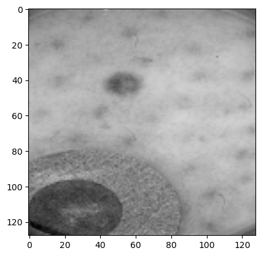
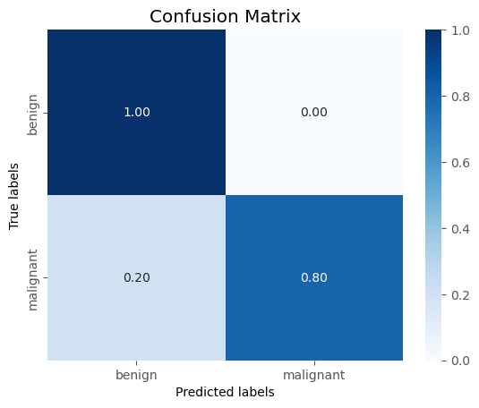

# Classification of benign and malignant tumor images

This project contains a model which classifies malignant to benign skin tumors. The data are located in 

https://www.kaggle.com/datasets/hasinisadunikasilva/skincancerdetectiondcnn

and they consist of images of benign and malignant skin tumors, already splitted to train and test set. 

<figure>
  
  <figcaption>Figure 1: Example of a tumor image </figcaption>
   
</figure>

Because the dataset is relatively small (2000 images of training set) we have augmented the data adjusting the brightness, the contrast and flipping the images randomly. 

The neural network model that produced the best results consists of: 

3 convolutional and 3 linear layers (including the layer of the last node). 

We present metrics such as the accuracy and the loss of the training and the test dataset. We also present precision, recall, f1-score and the ROC curve, as well as the confusion matrix. The model seems to predict accurately the benign tumors, and a large percentage of the malignant tumors. 

<figure>
  
  <figcaption>Figure 2: Confusion matrix of the model </figcaption>
   
</figure>
